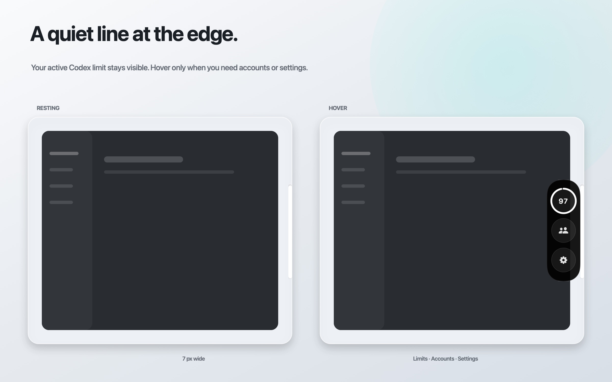
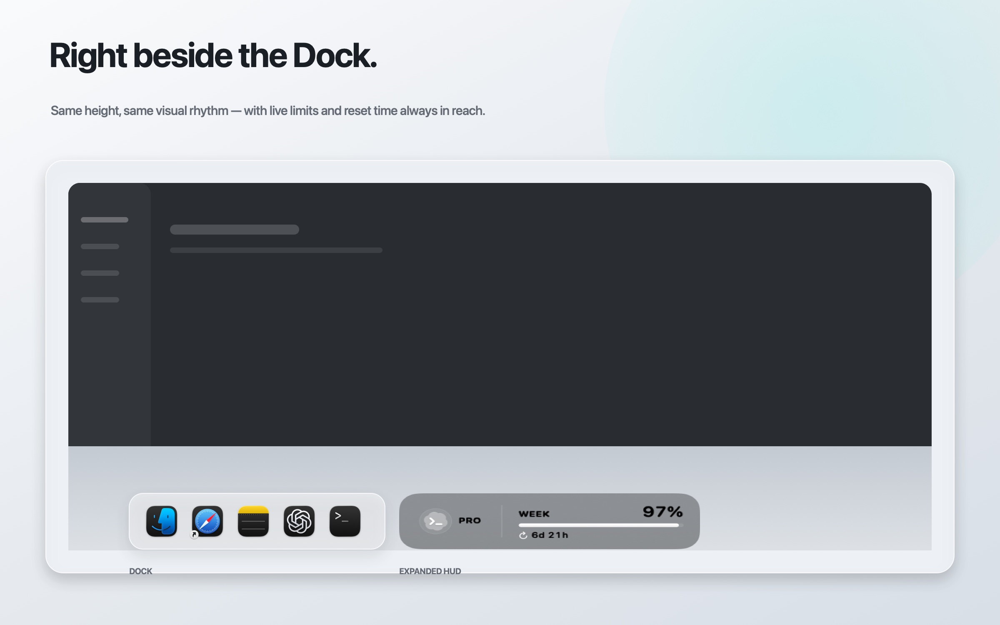

# Codex Relay

<p align="center">
  
</p>

<p align="center">
  <strong>Codex limits and accounts, one click away.</strong>
</p>

Codex Relay is a small, unofficial macOS utility that keeps your Codex usage at
the right edge of the screen or beside the Dock. It shows five-hour and weekly
limits, reset times, and lets you compare and switch between multiple Codex
accounts without losing local projects, sessions, or history.



## Features

- three HUD styles: Compact, Expanded, and a hover-revealed vertical Edge Strip;
- Edge Strip is the default on a new installation;
- the Edge Strip shows only the active short limit (or the weekly fallback) until expanded;
- placement beside the Dock, on the right edge, or anywhere on screen;
- saved positions for free and right-edge placement;
- automatic hiding over full-screen apps and video;
- every limit window currently reported by Codex;
- reset countdowns and available free reset credits;
- optional low-limit and reset notifications;
- 20 interface languages, automatic macOS language matching, and an instant manual override;
- locally recorded subscription paid-through date and remaining days;
- Pro tier labels (×5 and ×20) in the HUD and account details;
- multiple local account profiles in one list;
- account recommendations when the current limit runs out;
- account switching while keeping the same local Codex data;
- manual update checks through GitHub Releases;
- Launch at Login and configurable refresh intervals.



## Requirements

- macOS 13 Ventura or newer;
- Apple Silicon Mac (`arm64`);
- the Codex desktop app or an installed `codex` executable;
- Xcode Command Line Tools when building from source.

Native Liquid Glass is used on macOS 26 Tahoe. Older supported macOS versions
use a standard translucent material.

## Install

Download the latest Apple Silicon build from
[GitHub Releases](https://github.com/agavovich/codex-relay/releases/latest), unzip
it, and move **Codex Relay.app** to your Applications folder. The app is not
notarized yet, so macOS may require you to Control-click it and choose **Open**
on first launch.

## Build from source

```bash
git clone https://github.com/agavovich/codex-relay.git
cd codex-relay
chmod +x scripts/build-app.sh
./scripts/build-app.sh
open "dist/Codex Relay.app"
```

The generated app is placed in `dist/`.

To verify the source build:

```bash
swift build -c release
.build/release/CodexRelay --self-test
```

## Interface language

On first launch, **System language** chooses the first supported language in your
macOS language preferences, with English as the fallback. Choose **Settings →
App → Language** to override it without restarting; the choice survives relaunch.
Selecting **System language** restores automatic matching. All translations are
bundled with the app and work offline.

Supported: English, Russian, Spanish, French, German, Brazilian Portuguese,
Simplified Chinese, Traditional Chinese, Japanese, Korean, Italian, Turkish,
Arabic, Hindi, Indonesian, Vietnamese, Thai, Polish, Ukrainian, and Dutch.
Regional variants map to the supported language; Portuguese uses Brazilian
Portuguese. Chinese script preferences take priority over region. Arabic uses
right-to-left content while the Edge Strip stays on the physical right edge.

Dates and durations use the selected locale. User account names, email addresses,
plan names, external release notes, and raw upstream diagnostic details are not
translated. Translation wording has not yet been reviewed by native speakers
for every language.

Developers can validate the bundled catalog with
`python3 scripts/check-localizations.py` and the app's `--self-test` command.

## Multiple accounts

Open the HUD and choose **Add Account…**. Codex Relay creates an isolated local
profile and uses the official ChatGPT sign-in flow. Each account then appears
with its current limits and reset times.

When you switch accounts, Codex Relay closes Codex normally, changes only the
active credential, and opens Codex again. The shared `~/.codex` directory stays
in place, so projects, sessions, settings, and skills remain available. The app
asks for confirmation before switching and restores the previous credential if
the relaunch fails.

## Privacy

Codex Relay has no separate cloud service and does not require an API key.
Account credentials and profile information stay locally in:

```text
~/Library/Application Support/Codex Relay/
```

Credential directories use `700` permissions and credential files use `600`.
Codex Relay reads local credential metadata for account identity and the paid-through
date recorded at sign-in. It does not log or upload credentials. The paid-through
date can be stale after billing changes and does not indicate automatic renewal
status. The official Codex app still communicates with OpenAI as usual.
When you choose **Check for Updates…**, Relay sends a standard request containing
only its current version to the public GitHub Releases API.

## Notes

- Codex Relay is an independent community project and is not affiliated with or
  endorsed by OpenAI.
- It relies on Codex's local `app-server` interface, which may change in future
  Codex releases.
- Intel Mac support, signed releases, and notarization are not available yet.

## License

[MIT](LICENSE)
