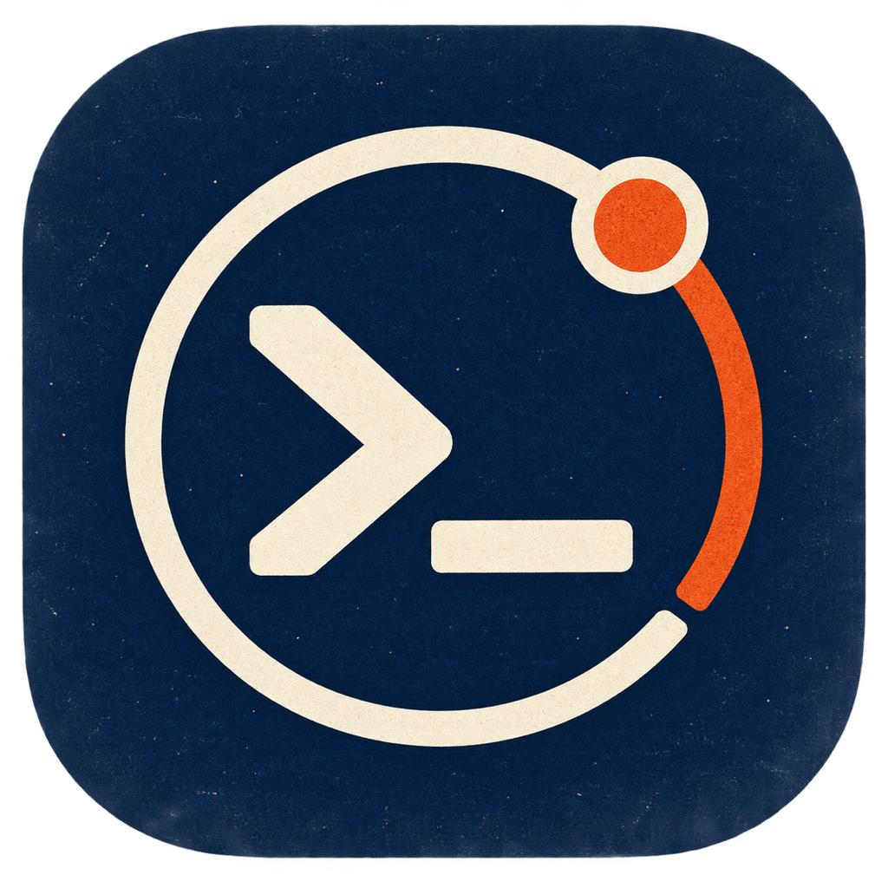
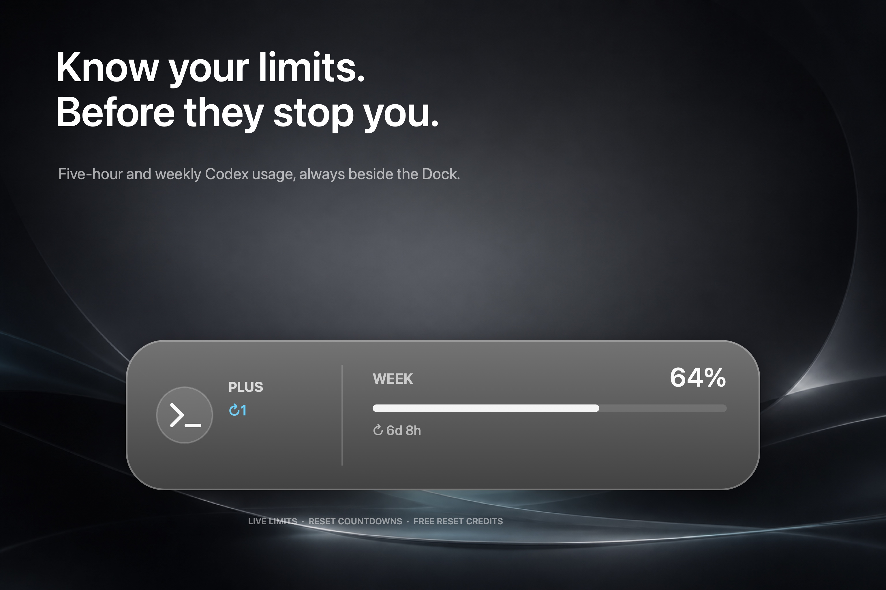
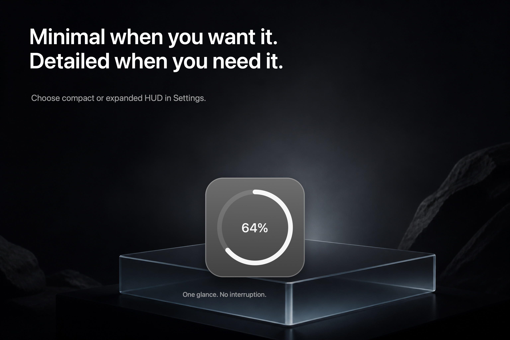
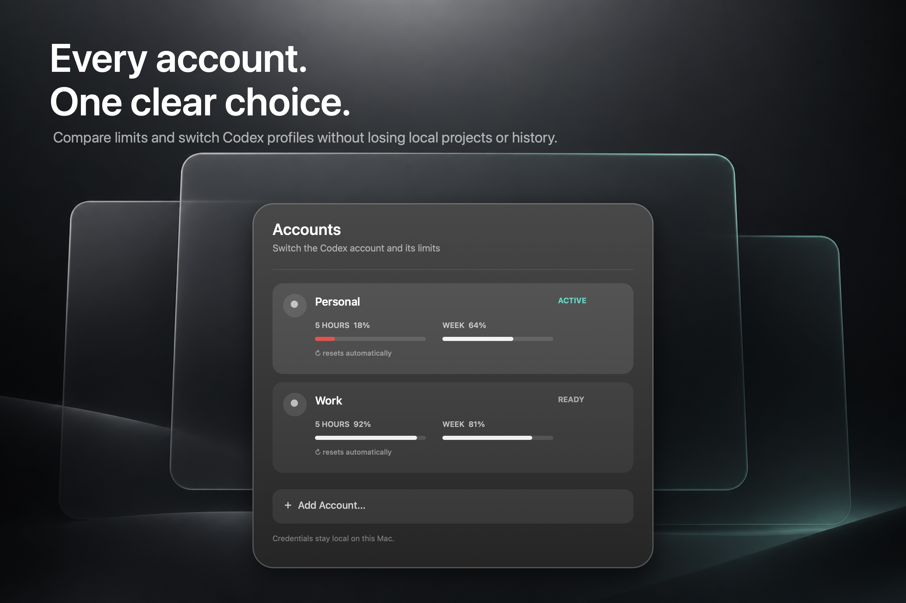

# Codex Relay

<p align="center">
  
</p>

<p align="center">
  <strong>Codex limits and accounts, one click away.</strong>
</p>

Codex Relay is a small, unofficial macOS utility that shows your Codex usage
beside the Dock. It keeps five-hour and weekly limits visible, shows when they
reset, and lets you compare and switch between multiple Codex accounts without
losing local projects, sessions, or history.



## Features

- three HUD styles: Compact, Expanded, and a hover-revealed Edge Strip;
- placement beside the Dock, on the right edge, or anywhere on screen;
- saved positions for free and right-edge placement;
- automatic hiding over full-screen apps and video;
- every limit window currently reported by Codex;
- reset countdowns and available free reset credits;
- optional low-limit and reset notifications;
- multiple local account profiles in one list;
- account recommendations when the current limit runs out;
- account switching while keeping the same local Codex data;
- Launch at Login and configurable refresh intervals.





## Requirements

- macOS 13 Ventura or newer;
- Apple Silicon Mac (`arm64`);
- the Codex desktop app or an installed `codex` executable;
- Xcode Command Line Tools when building from source.

Native Liquid Glass is used on macOS 26 Tahoe. Older supported macOS versions
use a standard translucent material.

## Install

Download the latest Apple Silicon build from
[GitHub Releases](https://github.com/agavovich/codex-relay/releases/latest), unzip
it, and move **Codex Relay.app** to your Applications folder. The app is not
notarized yet, so macOS may require you to Control-click it and choose **Open**
on first launch.

## Build from source

```bash
git clone https://github.com/agavovich/codex-relay.git
cd codex-relay
chmod +x scripts/build-app.sh
./scripts/build-app.sh
open "dist/Codex Relay.app"
```

The generated app is placed in `dist/`.

To verify the source build:

```bash
swift build -c release
.build/release/CodexRelay --self-test
```

## Multiple accounts

Open the HUD and choose **Add Account…**. Codex Relay creates an isolated local
profile and uses the official ChatGPT sign-in flow. Each account then appears
with its current limits and reset times.

When you switch accounts, Codex Relay closes Codex normally, changes only the
active credential, and opens Codex again. The shared `~/.codex` directory stays
in place, so projects, sessions, settings, and skills remain available. The app
asks for confirmation before switching and restores the previous credential if
the relaunch fails.

## Privacy

Codex Relay has no separate cloud service and does not require an API key.
Account credentials and profile information stay locally in:

```text
~/Library/Application Support/Codex Relay/
```

Credential directories use `700` permissions and credential files use `600`.
Codex Relay treats `auth.json` as opaque data: it does not parse, log, or upload
its contents. The official Codex app still communicates with OpenAI as usual.

## Notes

- Codex Relay is an independent community project and is not affiliated with or
  endorsed by OpenAI.
- It relies on Codex's local `app-server` interface, which may change in future
  Codex releases.
- Intel Mac support, signed releases, and notarization are not available yet.

## License

[MIT](LICENSE)
